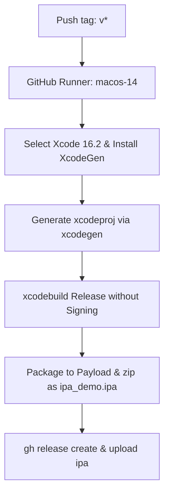

# MindFlow — 心灵与习惯追踪 iOS App Demo

<p align="center">
  <strong>一款极具现代设计感、交互精致的原生 iOS 心灵与习惯追踪应用程序。</strong>
</p>

---

## 🌟 核心特性 (Features)

*   **今日心情打卡**：横向滚动的磨砂玻璃质感 (Glassmorphism) 卡片，支持 5 种不同的情感等级选择，伴随微缩放交互反馈。
*   **环形进度追踪**：精美的渐变色今日打卡环形进度条，可动态反馈今日习惯的达成率。
*   **习惯卡片管理**：提供高颜值 SF Symbols 图标与专属主题色，轻触即可完成打卡并累积连续坚持天数 (Streak)。
*   **Swift Charts 数据看板**：
    *   **心情曲线**：展示近 7 天情绪起伏的渐变平滑折线图 (Catmull-Rom Area Chart)。
    *   **达成率柱状图**：展示近 7 天习惯完成比例的渐变圆角柱状图。
    *   **多维数据汇总**：包括“最佳连续天数”、“累计心情记录”等指标小卡片。
*   **高颜值弹窗新增**：支持用户点选内置的高保真图标与精选色块，快速定制和添加习惯。
*   **UserDefaults 持久化**：本地数据自动序列化存储，且在首次启动时自动灌入 7 天的历史 Mock 数据，确保图表立即呈现最佳的视觉效果。

---

## 🛠️ 技术栈与项目架构 (Technology Stack)

### 开发环境
*   **开发语言**：Swift 6.2 / Swift 5
*   **界面框架**：SwiftUI (要求 iOS 17.0+ 最低部署版本)
*   **数据可视化**：Swift Charts 框架 (iOS 16.0+ 原生支持)
*   **工程构建器**：[XcodeGen 2.x](https://github.com/yonaskolb/XcodeGen) (用于声明式管理 `.xcodeproj` 工程)
*   **CI/CD 流水线**：GitHub Actions (集成 macOS 构建环境)

### 架构设计 (Architecture)
项目严格遵循 SwiftUI 推崇的 **MVVM 数据流模式**：
*   **Model (`MoodEntry`, `Habit`, `DailyCompletion`)**：纯 Swift 结构体，支持 `Codable` 用于 JSON 数据持久化。
*   **ViewModel / Store (`HabitStore`)**：符合 `ObservableObject` 协议。作为单一数据源 (Single Source of Truth)，集中处理数据读取、保存、状态变更和图表数据的历史计算。
*   **View (`DashboardView`, `StatsView`, `AddHabitSheet`)**：声明式 SwiftUI 视图组件。通过 `@EnvironmentObject` 注入状态模型，利用组合式 UI、SwiftUI 动画与材质背景（`.ultraThinMaterial`）保证界面高级质感。

---

## 📂 项目结构指南

```
ipa_demo/
├── .github/
│   └── workflows/
│       └── release.yml     # GitHub Actions 自动化打包及发布工作流
├── Sources/
│   ├── Models/
│   │   └── HabitStore.swift # 数据模型、本地持久化与 ViewModel 逻辑
│   ├── Views/
│   │   ├── MainTabView.swift    # 底部导航入口页
│   │   ├── DashboardView.swift  # 心情及习惯打卡主看板 (Today Tab)
│   │   ├── StatsView.swift      # Swift Charts 历史趋势分析页 (Stats Tab)
│   │   └── AddHabitSheet.swift  # 高颜值习惯添加半屏弹窗 (Sheet)
│   ├── Assets.xcassets/     # App 资源配置（包含 AppIcon 与全局 AccentColor）
│   └── ipa_demoApp.swift    # 原生 iOS 应用程序入口
├── project.yml              # XcodeGen 的声明式项目描述文件
└── README.md                # 本技术与使用说明文档
```

---

## 🚀 本地开发与构建 (Local Development)

### 1. 安装项目生成器 `xcodegen`
本仓库没有将大体积且易引发 Git 冲突的 `.xcodeproj` 文件提交至代码管理，您需要使用 `XcodeGen` 来本地一键生成：
```bash
brew install xcodegen
```

### 2. 生成 Xcode 项目工程
在项目根目录下，运行以下指令。它将读取 `project.yml` 并在本地创建 `ipa_demo.xcodeproj`：
```bash
xcodegen generate
```

### 3. 本地编译与运行
1. 用 Finder 打开根目录，双击 **`ipa_demo.xcodeproj`** 以启动 Xcode。
2. 在 Xcode 顶部的 Target 列表中，选择您的物理设备或任意 iOS 模拟器 (推荐使用 iPhone 15 或 iPhone 16，系统要求 >= iOS 17.0)。
3. 按下快捷键 `Cmd + R`，即可一键编译并进入模拟器体验。

---

## 🤖 GitHub Actions 自动化打包 (.ipa)

我们已在工作流中为您的 GitHub 仓库配置了 **自动化打包流水线**（定义在 `.github/workflows/release.yml`）：



### 运行原理说明
*   **版本触发**：只要您在本地为代码打上标签（如 `git tag v1.0.4`）并推送到 GitHub 远端（`git push origin v1.0.4`），工作流就会自动在云端触发。您也可以在 GitHub 的 Actions 页面上进行手动触发运行。
*   **免证书签名 (Unsigned)**：工作流在调用苹果编译指令 `xcodebuild` 时，加入了如下配置：
    ```bash
    CODE_SIGNING_ALLOWED=NO CODE_SIGNING_REQUIRED=NO CODE_SIGN_IDENTITY="" CODE_SIGN_ENTITLEMENTS=""
    ```
    它会在零付费苹果证书的前提下成功生成 `ipa_demo.app`。
*   **打包与发布**：工作流随后会将应用程序移入 `Payload` 目录，将其压缩并重命名为 `ipa_demo.ipa`。最后，调用 GitHub CLI 工具自动建立 Release 并上传此 `.ipa` 文件。

---

## 📲 如何安装编译出来的 `.ipa` 文件

由于云端输出的 IPA 为**无签名版本**，无法通过苹果的 App Store 直接安装。您可使用以下方式安装至手机中体验：

### 方式 1：通过 Sideloadly 签名侧载 (推荐 ⭐️，支持最新 iOS 17 & 18)
*   **操作**：在电脑（Mac/Windows）上下载 [Sideloadly](https://sideloadly.io/)，将 iPhone 连上电脑（需开启手机上的 `设置 -> 隐私与安全 -> 开发者模式` ）。
*   **签名**：将 `ipa_demo.ipa` 拖入软件，在 `Apple Account` 输入您的个人免费 Apple ID 并点击 `Start` 即可完成。
*   **信任证书**：首次打开应用前，需到手机的 `设置 -> 通用 -> VPN 与设备管理` 信任您的 Apple ID。
*   *注意：免费个人签名的 App 有效期为 7 天，过期闪退后需连上电脑重新在 Sideloadly 中点击 Start 一键续签。*

### 方式 2：使用 TrollStore 巨魔商店 (最完美，免电脑，永不过期)
*   **限制**：仅支持系统版本在 **iOS 14.0 到 iOS 16.6.1**，以及 **iOS 17.0** 的设备。
*   **安装**：将下载好的 `ipa_demo.ipa` 通过隔空投送 (AirDrop) 或者是文件共享传输至手机上，选择“使用 TrollStore 打开”，点击 `Install` 即可直接安装。此方式安装的 App 永不过期、无数量限制。
